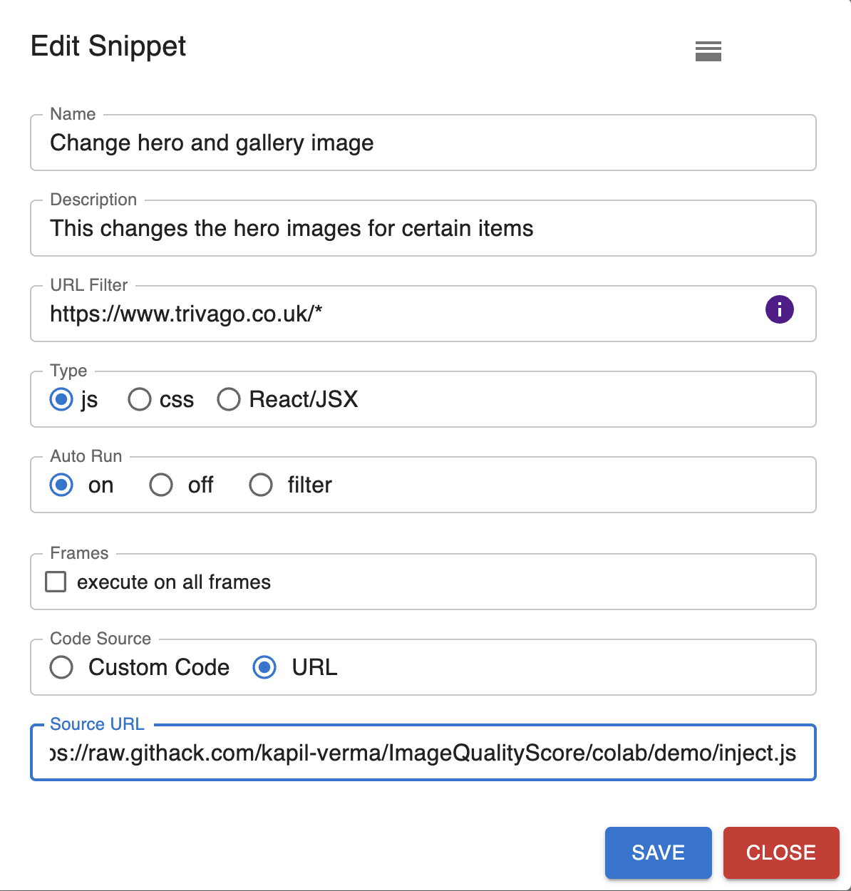

# Optilens

## Demo

- [Item search](https://www.trivago.co.uk/en-GB/srl/hotel-nh-d%C3%BCsseldorf-city?search=100-6365;dr-20240426-20240427;rc-1-2-10)
- [Item search with Optilens](https://www.trivago.co.uk/en-GB/srl/hotel-nh-d%C3%BCsseldorf-city?search=100-6365;dr-20240426-20240427;rc-1-2-10&optilens)

### Script

- https://raw.githack.com/kapil-verma/ImageQualityScore/colab/demo/inject.js

### Setup

.

* Name: `Change hero and gallery image`
* Description: `This changes the hero images for certain items`
* Type: `js`
* Auto Run: `on`
* Code Source: `URL`
* Source URL: `https://raw.githack.com/kapil-verma/ImageQualityScore/colab/demo/inject.js`
